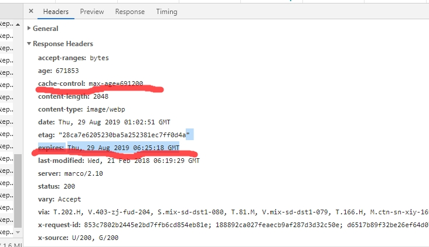
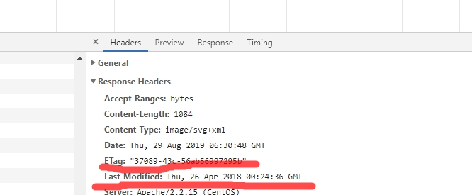
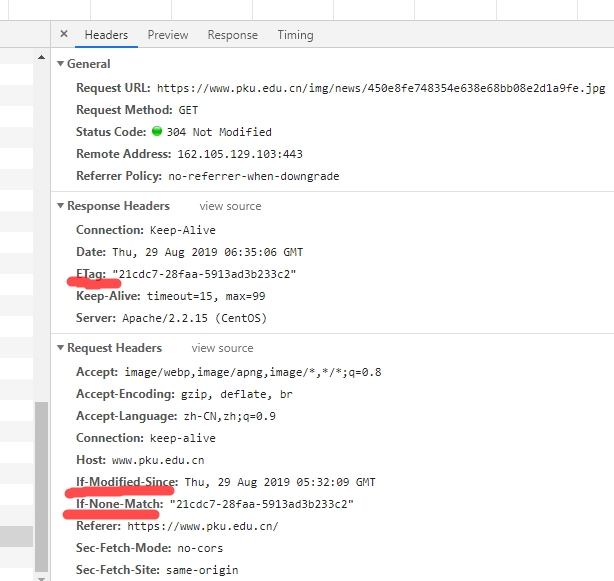

# http 缓存机制
> HTTP协议是Hyper Text Transfer Protocol（超文本传输协议）的缩写,是用于从万维网（WWW:World Wide Web ）服务器传输超文本到本地浏览器的传送协议。。
> HTTP是一个基于TCP/IP通信协议来传递数据（HTML 文件, 图片文件, 查询结果等）。
## http报文中与缓存相关的字段
- 通用首部字段（请求与响应都能用的字段）
 
    |名称|说明|
    |:--|:--| 
    |cache-control|是HTTP/1.1.0控制浏览器缓存的主流字段，通用指令下面详解|
    |Pragma|是HTTP/1.0.0 遗留的通用字段，值为no-cache时，禁止使用缓存|
    - cache-control和浏览器相关的几个指令

        |名称|说明|
        |:--|:--| 
        |public|表明响应可以被任何对象（包括：发送请求的客户端，代理服务器，等等）缓存|
        |private|表明响应只能被单个用户缓存，不能作为共享缓存（即代理服务器不能缓存它）|
        |no-cache|需要使用对比缓存来验证缓存数据|
        |no-store|不缓存请求或响应的任何内容|
        |max-age=[s]|资源过期的相对时间|

- 请求首部字段
 
    |名称|说明|
    |:--|:--| 
    |if-Match|比较Etag是否一致|
    |if-None-Match|比较Etag是否不一致|
    |if-Modified-Since|比较资源最后更新的时间是否一致|
    |if-Unmodified-Since|比较资源最后更新的时间是否不一致|
- 响应首部字段
    |名称|说明|
    |:--|:--| 
    |Etag|资源匹配标识符|
- 实体首部字段
    |名称|说明|
    |:--|:--| 
    |Expires|http1/1.0.0的遗留物，资源过期的时间，绝对时间|
    |Last-Modified|资源最后一次更新的时间|
## http缓存规则
> 根据是否需要向服务器重新发送请求，此处分为强制缓存和对比缓存，对比缓存也叫协商缓存
- 强制缓存请求数据的流程
    - 有缓存数据
        ```plantuml
            客户端 -> 缓存数据库 : 请求数据
            缓存数据库 --> 客户端 : 缓存数据未失效，返回缓存数据
        ```
    - 缓存失效
        ```plantuml
            客户端 -> 缓存数据库 : 请求数据
            缓存数据库 --> 客户端 : 缓存失效，返回缓存数据
            客户端 ->服务器 : 请求数据
            服务器 -->客户端 : 返回请求数据，缓存规则
            客户端 ->缓存数据库 : 将请求到的数据和缓存规则存入缓存数据库

        ``` 
- 对比缓存请求数据的流程   
    - 有缓存数据
        ```plantuml
            客户端 -> 缓存数据库: 请求数据缓存标识
            缓存数据库 --> 客户端: 返回数据缓存标识
            客户端 -> 服务器 :请求服务器验证缓存标识符对应的数据是否改变
            服务器 --> 客户端:通知客户端缓存数据未失效
            客户端 ->缓存数据库:获取缓存数据
        ```  
    - 缓存失效
        ```plantuml
            客户端 -> 缓存数据库: 请求数据缓存标识
            缓存数据库 --> 客户端: 返回数据缓存标识
            客户端 -> 服务器 :请求服务器验证缓存标识符对应的数据是否改变
            服务器 --> 客户端:缓存失效，返回新数据和缓存规则
            客户端 -> 缓存数据库:保存新数据和缓存规则到缓存数据库
  
        ``` 
## 强制缓存
> 强制缓存分为两种情况，Expires和Cache-Control。
- Expires
    > Expires的值时服务器告诉浏览器资源的缓存过期时间，是一个绝对时间，比如：2019-05-29 17:15:12,当浏览器下次请求时，若请求时间没有超过此时间，则直接使用缓存数据，否则重新请求新数据。通常浏览器的时间用户可以自己设置，因此这一字段在http/1.1.0版本中被Cache-Control字段替代啦。
- Cache-Control 
    > 由于浏览器和服务器时间不同步，因此http/1.1.0的版本中，引入了新的解决方法，即Cache-Control，它表示一个相对时间，即服务器发给浏览器一个相对时间，例如，Cache-Control:36000,表示从服务器发送资源给浏览器后10小时之后，此资源就过期作废了，否则浏览器二次请求时，使用缓存资源。
    
    **示例**
        
## 对比缓存
> 
- Last-Modified和If-Modified-Since
    > Last-Modified:服务器在响应请求时，告诉浏览器资源的最后修改时间。
    > If-Modified-Since:: 浏览器再次请求服务器的时候,请求头会包含此字段，表示缓存中的资源最后一次更新的时间。服务端收到此请求头发现有if-Modified-Since，则与被请求资源的最后修改时间进行对比，如果一致则返回304和响应报文头，浏览器只需要从缓存中获取信息即可，若不一致，则重新获取新数据

     **示例**
        
- ETag 和 if-None-Match
    > ETag:服务器响应请求时，通过此字段告诉浏览器当前资源在服务器生成的唯一标识
    > If-None-Match: 再次请求服务器时，浏览器的请求报文头部会包含此字段，后面的值为在缓存中获取的标识。服务器接收到次报文后发现If-None-Match则与被请求资源的唯一标识进行对比,若一致，资源没有修改，则响应304即可，浏览器使用缓存数据即可；若不一致，资源已改变，则响应整个资源，返回状态码200

     **示例**
    
## 最佳实践
>使用强缓存时，若xx时间内，服务器资源修改了，或者版本直接更新了，客户端在没有强制刷新的情况下，看到的内容还是旧的；

> 协商缓存每次都要向服务器验证一下缓存的有效性，不管缓存能不能用，都要向服务器验证有效性，每次都去请求服务器，那要缓存还有什么意义；
 
> 基于以上问题，实际中，前端都会这样做：尽可能命中强缓存，同时，能在更新版本的时候让客户端的缓存失效，为了能让客户端知道版本已经更新啦，开发人员顺便把静态资源的路径改了，这样，就相当于第一次访问这些资源，就不会存在缓存的问题了。而修改资源路径，当然是webpack的打包时的文件名hash啦！综上所述，我们可以得出一个较为合理的缓存方案：
- HTML：使用协商缓存。
- CSS&JS&图片：使用强缓存，文件命名带上hash值。       