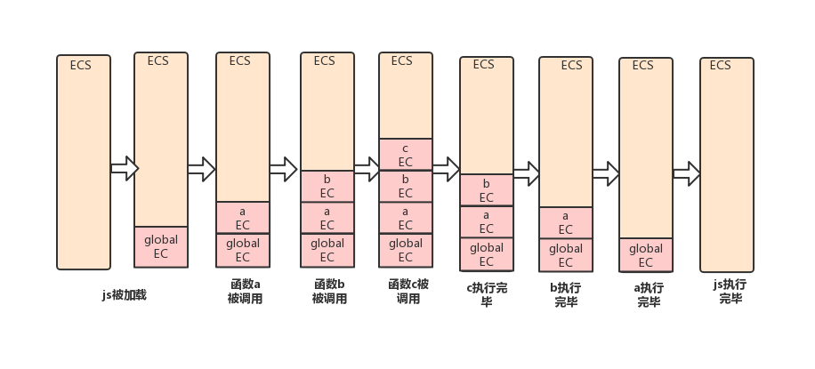
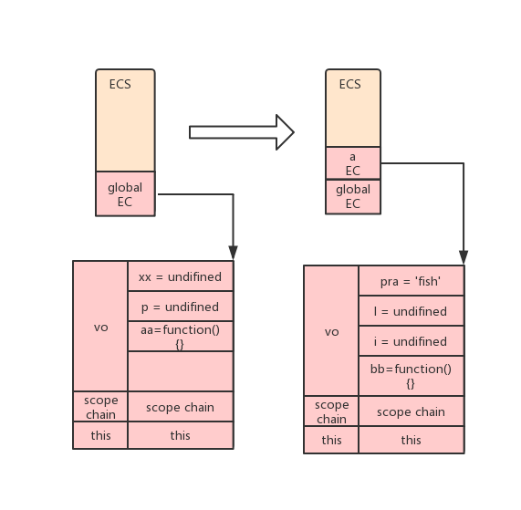

**一、 javascript 中的执行上下文**
- javascript的解释和执行阶段
  - 解释阶段
     - 词法分析
     - 语法分析
     - 作用域规则确定
  - 执行阶段
    - 执行上下文创建
    - 代码执行
    - 回收垃圾


**二、 执行上下文的相关概念**

2.1. 执行上下文的类型
> javascript总共有三种执行上下文
+ 全局执行上下文（Global Execution Context）:一个全局对象，一个程序只有一个，在浏览器环境中，此对象就是window对象，this指向此对象；
+ 函数执行上下文（Function Execution Context）:只有在函数被调用的时候才被创建，每次调用函数都会创建一个新的函数执行上下文
+ Eval函数执行上下文：运行在 eval 函数中的代码也会拥有自己的执行上下文，js中不常用eval函数;

2.2. 执行环境栈
> 执行环境栈（Execution context Stack）是js引擎分配的一段栈内存，具有先进后出（FILO）的结构，用于存储代码执行过程中创建的执行上下文，js引擎总是访问栈顶的执行上下文;
> JS是运行在单线程上的，所有代码都得排队执行，浏览器在开始执行代码时，先会创建一个全局执行上下文，并把此执行上下文push到当前栈的底部，每当一个函数被调用时，就会创建一个新的函数执行上下文，将此函数执行上下文push到当前栈的顶部，当函数执行完时，当前的函数执行上下文出战，等待垃圾回收；全局上下文只有当浏览器窗口关闭时，才会出栈等待垃圾回收！

```javascript
    var name = "mark";
    function a (){
        console.log(this.name,"..........a");//mark ..........a
        function b(name) {
            console.log(name,"...........b");//mark ...........b
            function c() {
                console.log(name,"........c")//mark ........c
            }
            return c();
        }
        b(this.name);
        consle.log("nnnn")
    }
    a();
    /**
     * 执行环境栈中执行上下文的变化：
     *
     * 这段代码被浏览器加载时，js引擎会先创建一个全局执行上下文，记作Global EC,并将global EC压入执行环境栈的底部（Excution Context Stack，简称ecs）
     * 当函数a被调用时，创建函数a的函数执行上下文，记作a Ec，并将a EC压入ecs中；
     * 在a函数执行的过程中，b函数被调用，此时，创建b函数的执行上下文，记作b EC，并将b EC压入ecs中；
     * 在b函数的执行过程中，c函数被调用，此时，创建c函数的执行上下文，记作c EC，并将c EC压入ecs中；
     * c函数执行完毕后，执行上下文c EC跳出执行环境栈ecs，等待垃圾回收，
     * 此时，随之c函数的执行完毕，b函数也随之执行结束，因此，执行上下文b EC被弹出执行环境栈ecs，等待垃圾回收，
     * 此时，js引擎指向执行环境栈中的a EC,继续执行a函数未被执行的部分，
     * 待a函数执行完毕后，a EC也被弹出执行环境栈ecs，等待垃圾回收，
     * 此时，执行环境栈中只有全局上下文 global EC,待浏览器窗口关闭收，global EC被弹出执行环境栈，待定垃圾回收机制回收，
     * 至此，这段代码就被执行完毕
     */
```
*上述代码中的执行上下文在执行环境栈中的变化，如下图所示*


**三、 执行上下文的生命周期**

3.1.创建
+ 创建变量对象（variable object）或者激活对象（active Object）：提升函数声明和变量声明，初始化函数的参数arguments,函数的优先级高于变量，若函数与变量同名，则变量会被忽略掉;
  + 创建arguments对象，初始化参数名称和值,并创建引用的赋值
  + 扫描上下文中的函数声明,非函数表达式
    >> 把上下文中发现的每一个函数，挂载到变量对象上，即把函数名作为变量对象的属性，变量对象的属性值指向函数在内存中的存放地址，若函数名存在，则引用指针被重写
  + 扫描上下文中的变量声明
    >> 把上下文中发现的变量声明，挂载到变量对象上，即把变量名作为变量对象的属性，变量对象的属性值设置文undefined，若变量名已经存在，则不做任何处理
  > 变量对象：执行上下文中存放此上下文中可以被访问的变量声明、形参、函数标识符等，它们被挂载到此对象中，它们的名称与值与此对象的属性与值相互对应；
  > 激活对象：每当进入一个执行上下文时，这个执行上下文中的对象就被激活，即该上下文中的函数标识符、变量声明就可以访问了！
  ```javascript
    // 例1 变量声明的提升
    console.log(a); //undefined
    var a = 100;
    // 创建上下文时，先扫描到变量a,给其赋值undifined，执行阶段逐行执行
    // 相当于如下：
    var a;
    console.log(a);
    a=100;

    // 例2 函数声明的提升；
    console.log(c); //ƒ c(){ console.log("大白兔");}
    function c(){
            console.log("大白兔");
    };
    console.log(d); // undifined
    var d = function(){console.log("小白兔")}
    // 创建上下文时，函数c被作为变量对象的属性存储，变量对象的值指向了此函数在内存中的地址，即a函数被整体提升啦，
    // d是作为变量被声明的，因此初始化时给其赋值undifined的


    // 例3 函数与变量同名被声明
    console.log(aa,); // ƒ aa() {console.log("my name is function");}
    var aa = "my name is varible";
    console.log(aa); //my name is varible
    function aa() {
            console.log("my name is function");
    }
    console.log(aa); // my name is varible
    // 创建上下文时，先扫描函数声明跟变量声明，重名时，函数声明优先级高，覆盖变量声明，
    //执行阶段，逐行执行，因此第一次输出函数aa ，第二次输出前变量aa被赋值"my name is varible"，因此，输出"my name is varible"；
    //第三次输出前，没有变化，同第二次，因此还是输出"my name is varible"
  ```
  *执行上下文中，变量对象的存储方式-----代码分析*
  ```javascript
     // 分析执行上下文中变量对象的存储
    var xx = "what is this?";
    var p = "fish";
    function aa (pra){
        var l = 10;
        for(var i = 0;i<l;i++) {
            console.log(this.xx);
            console.log(`these are ${i} ${this.p}`);
            bb(i);
        }
        function bb (i){
            cosole.log(i)
        }
    }
    aa(p);
    /**
     * 创建全局执行上下文，记作 Global EC，并在此上下文中创建变量对象vo，js引擎扫描变量声明和函数声明，
     * 并添加的变量对象vo中 如 vo = {xx:undifined,p:undifined,aa:function(){}},
     *
     * 函数a被调用时，创建函数执行上下文，记作aa EC，并在此上下文中创建变量对象vo，js引擎扫描形参，变量声明，函数声明等，
     * 并天骄到变量对象vo中，如vo = {pra:'fish',l:undifined,i:undifined,bb:function(){}}
     */
  ```
   *执行上下文中，变量对象的存储方式----图例分析（借用上面代码）*
  
+ 创建作用域链（scope chain）
+ 确定 this 指向：this的值直到执行阶段才能确定，
  ```javascript
   // 例1 this指向 window
   var name = 'mark';
   function bb (){
           console.log(this.name);
   }
   bb();// mark
   //变量 name为全局变量，定义在全局上下文中，this指向window

   // 例2 this指向构造函数对应的实例
   function cc(name,age){
          console.log(this);//cc {}
          this.name = name;
          this.age = age;
          console.log(this) //cc {name: "mm", age: 16}
   }
   var ccc = new cc('mm',16);
   // new 关键字创建对象ccc是，会在构造函数内部隐式的创建 this = {}作为该构造函数的一个实例对象，因此此时的this指向此实例

   // 例3 this 指向某一对象
   var oo = {
        name:'mark',
        logo:function(){
                console.log(this);//{name: "mark", logo: ƒ}
                console.log(this.name);//mark
         }
   }
   oo.logo();
   // 此时logo函数是oo对象的一个属性，logo函数只能被oo对象调用，因此，this只能指向logo函数的调用着oo


   // 例4 call apply 改变this指向
   function pp (age,gender){
        console.log(this);//{name: "mark"}
        console.log(`my name is ${this.name},i am ${age} years old,I am a ${gender}`)
   }
   var obj = {name:'mark'}
   pp.call(obj,10,'boy');//my name is mark,i am 10 years old,I am a boy
   pp.apply(obj,[20,'girl']);//my name is mark,i am 20 years old,I am a girl
   // apply ,call bind函数内部都会改变this指向，将this指向当前函数的第一参数
   // 源码中有  context = context || window; context为函数的第一参数


   // 例5 箭头函数中
   var oo = {
        logo:()=>{
                console.log(this);//global {snapshotAuxiliaryData: {…}, generateSnapshot: null, snapshotResult: {…}, postMessage: ƒ, blur: ƒ, …}
                console.log(window === this) // true
        }
   }
   oo.logo();
   // 箭头函数中没有this,因此在箭头函数内部使用this时，this指向它的父级上下文中的this，此处就指向全局上下文window
   var ooo = {
        name :'pp',
        logo:function(age){
                console.log(this);//{name: "pp", logo: ƒ}
                this.age = age;
                return ()=>{
                        console.log(this);//{name: "pp", age: 16, logo: ƒ}
                }
        }
   }
   ooo.logo(16)();
   //箭头函数中没有this,因此在箭头函数内部使用this时，this指向它的父级上下文中的this，其父级上下文为logo函数的上下文,logo函数上下文中的this指向ooo对象
  ```

3.2. 执行
> 执行变量赋值，代码执行

3.3. 回收
> 执行上下文出栈，等待被垃圾回收机制回收
