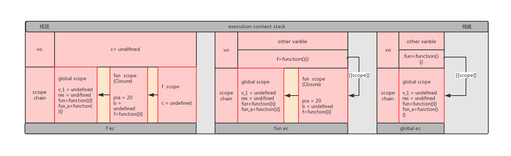

# javascript 作用域与作用域链
**一、作用域**
*1.1、作用域的定义*
> 官方解释：作用域（scope），程序设计概念，通常来说，一段程序代码中所用到的名字并不总是有效/可用的，而限定这个名字的可用性的代码范围就是这个名字的作用域。
> 通俗解释：作用域指你当前代码的上下文环境，也就是说，当前变量，对象、函数等能够被应用的范围。

*1.2、作用域分类*
> 我们通常说的函数作用域有以下几种，前三种为常用说法，但后两种也渗透在前三种中：
+ 全局作用域
> 在代码的任何地方都可以访问到的变量对象，就位于全局作用域中，window下面的变量都在全局作用域范围里，全局作用域常见的范例如下。
```javascript
    // 例1 声明为全局变量
    var a = 66;
    function bb(){
        console.log(a) //66
    }
    console.log(a) //66
    bb();
    // js引擎在解析此段代码时，会创建全局作用域global scope 和函数作用域bb scope
    // 此处的函数bb、变量a就在全局作用域中，因此函数bb,以及变量a可在任何地方被访问到，包括函数作用域bb scope内部

    // 例2 未声明直接赋值
    function cc(){
        mm = 10;
        var n = 8;
        console.log(mm+n);//18
    }
    cc();
    console.log(mm);//10
    console.log(n);//Uncaught ReferenceError: n is not defined
    //未被声明直接赋值的变量，js引擎在解析的时候自动提升为全局变量，
    //未被声明直接赋值的变量，限定在全局作用域范围内，因此虽然是在函数cc内部被赋值，但在函数外部同样可以访问到
```
+ 函数作用域
> 每定义一个函数，就会创建一个函数作用域，函数作用域限定了定义在函数内部的变量等标识符只能在此函数内部使用。
```javascript
    // 例1 函数内部定义的变量
    function dd(){
        var pp = 1212;
        console.log(pp);//1212
    }
    console.log(pp); // Uncaught ReferenceError: pp is not defined
    // 函数内部声明的变量，其作用使用范围，被限定只能在函数内部使用，只就是函数作用域的作用

```
+ 块级作用域（es6）
> es6之前的javascript是没有块级作用域的说法的，块级作用域可通过新增命令 let 和 const 声明，块级作用域可以在一个函数内部、在一个由一对大括号包裹的代码块中被创建。
```javascript
    // 例1 块级作用域
    function blockscope(){
        const len = 10;

        // 用var声明的变量j,此变量被提升，在函数作用域内都可访问到
        for(var j = 0;j<len;j++){
            console.log(j);//
        }
        console.log(j)//10

        // 用let声明的变量i，此变量属于块级作用域，只能在for循环内部使用，
        for(let i =0;i<len;i++){
            console.log(i); //0 1 2 3 4 5 6 7 8 9
        }
        console.log(i)//scope.html:54 Uncaught ReferenceError: i is not defined

        console.log(len);//10
    }
    blockscope();


    // 例2 块级作用域的应用
    //如下为html中的四个div元素
    // <div></div>
    // <div></div>
    // <div></div>
    // <div></div>

    var divs = document.getElementsByTagName("div");
    for(var i=0;i<divs.length;i++){
        divs[i].onmouseover = function() {
            console.log(`这是第${i}个div元素`);//这是第4个div元素
        }
    }
    //此段代码被js引擎解析的时候，先创建一个全局作用域，全局作用域里有变量divs、i、和四个函数divs[0],divs[1],divs[2],divs[3]，
    //然后创建每个函数的作用域，函数作用域里面无任务变量等表示符
    //for循环绑定事件后，i已经变为4，
    //无论你悬浮到那一个div,当触发对应事件函数的时候，由于函数最用于中找不到i,依次到全局作用域中找，找到i=4；因此每次都会输出4

    for(let i=0;i<divs.length;i++){
            divs[i].onmouseover = function() {
            console.log(`这是第${i}个div元素`);
             // 这是第0个div元素
             // 这是第1个div元素
             // 这是第2个div元素
             // 这是第3个div元素
        }
    }
    // js引擎解析，先创建一个全局作用域，由于for循环中的变量i是用let声明的，因此全局作用域中无标识符，
    // 由for循环构建四个块级作用域，记作for-0、for-1、for-2、for-3、每个块级作用域中都包含一个变量i,其值依次为0,1,2,3，块级作用域中还包含四个函数表示符divs[0],divs[1],divs[2],divs[3]，
    // 最后创建每个函数的函数作用域，函数作用域中无任何变量等表示符
    // 因此，当触发每个div对应的函数的时候，先从自己的函数作用域里面去找，无变量i,再到对应的块级作用域里面找，能够找到对应的变量i,因此会依次打印出上述结果

```
+ 词法作用域（静态作用域）
> 简单地说，词法作用域就是定义在词法阶段的作用域。换句话说，词法作用域是由你在写代码时将变量和块作用域写在哪里来决定的，因此当词法分析器处理代码时会保持作用域不变(大部分情况下是这样的)。
```javascript
    // 例1 静态作用域
    function ff(){
        console.log(pp)
    }
    var pp = 100;
    function mm(func){
        var pp = 66;
        return func();
    }
    mm(ff); //100
    // 分析，先创建全局作用域global-scope，包含变量pp=100,函数ff和函数，mm,
    // 然后创建两个函数作用域ff-scope和mm-scope，ff-scope中无变量标识符，mm-scope中包含变量pp=66，参数func，指向函数ff
    // 函数执行阶段，当函数ff被调用时，先在ff-scope中查找pp，没有找到，然后沿着作用域链到全局作用域中，找到pp=100，因此输出值为100
    // 此处打印出的pp的值，不是函数被调用的位置所在的作用域mm-scope中的pp=60，而是函数被定义的位置所在的作用域global-scope中的变量pp=100

    //例2 静态作用域
    function aa(){
        var _b = 100;
        function bb(){
            alert(_a+_b)
        }
        return bb;
    }
    var _a = 50;

    var x = aa();
    var _b = 60;
    x(); //150
    // js解释阶段，执行阶段的原理同上述例1
```
+ 动态作用域
> 在JS里，动态作用域和this机制息息相关。它的作用域诗是在运行的过程中确定的
> 词法作用域是在写代码或者说定义时确定的，而动态作用域是在运行时确定的。(this 也是!)
> 词法作用域关注函数在何处声明，而动态作用域关注函数从何处调用。
```javascript
    // 例1 动态作用域
    var aaa = 1;
    function f() {
        var aaa = 666;
        console.log( this.a );
    }
    f(); // 1
    // 从结果看，f中打印出aaa的值不是由写代码的位置确定的，而是取决于f执行的位置。也就是说，
    // 打印出的a的值不是console.log代码输出所在的函数作用域中aaa的值，而是函数f被调用时所处的全局作用域中的aaa的值

```


*1.3、作用域与执行上下文*
> 作用域是在变量、函数被定义时就创建的，变量、函数被创建时js引擎就会通过词法分析、语法分析等手段创建标识符指向这些变量或者函数;
> 执行上下文是在代码加载，函数被调用的时候创建的，全局执行上下文只有一个，函数每次调用，都会创建新的函数执行上下文;
**二、作用域链**
*2.1、作用域链的理解*
> 作用域链是由当前作用域与上层一系列父级作用域组成，作用域的头部永远是当前作用域，尾部永远是全局作用域。作用域链保证了当前上下文对其有权访问的变量的有序访问。
> 作用域链是一个数组，控制变量作用域的有序访问；作用域链存储在函数的执行上下文中，作用域链中存放的是执行环境中的变量对象（varible objec-----简称vo)或者激活对象(active object-----简称ao);
> 当前函数的作用域对像位于作用域链的最前端，全局作用域对象在作用域链的最末端。js引擎是通过变量或者函数标识符从作用域链的最前端开始查找，依次到作用域链的最后段，直到找到为止，若没有找到，则抛出异常
*2.2、作用域链与执行上下文*
> 执行上下文被创建的时，会同时在此上下文中创建\[[scope]],指向此上下文的父级作用域,这样一系列的嵌套使用，就构成了作用域链

***图解作用域链的执行过程***
```javascript
   // 代码示例
    var v_1 = 20;
    function fun (pra){
        var b = 66;
        function f(){
            var c = 20
            console.log(pra+b+c)
        }
        console.log(f)
        return f;

    }
    console.log(fun)

    var res = fun(v_1)
    res();
    // js引擎解析时，创建全局执行上下文global ec以及全局作用域global scope;全局上下文中定义的函数fun被声明时，通过其属性[[scope]]指定其作用域global scope;
    // 函数 fun 被调用时，创建函数执行上下文fun ec，执行上下文fun ec中的函数f被定义时创建其函数作用域（此处也叫闭包作用域）fun scope，通过函数f的属性[[scope]]执行其作用域fun scope,
    // 返回的闭包被调用，即函数f被调用时，创建函数执行上下文f ec,并创建local作用域f scope;
    //图解如下图所示：
```

