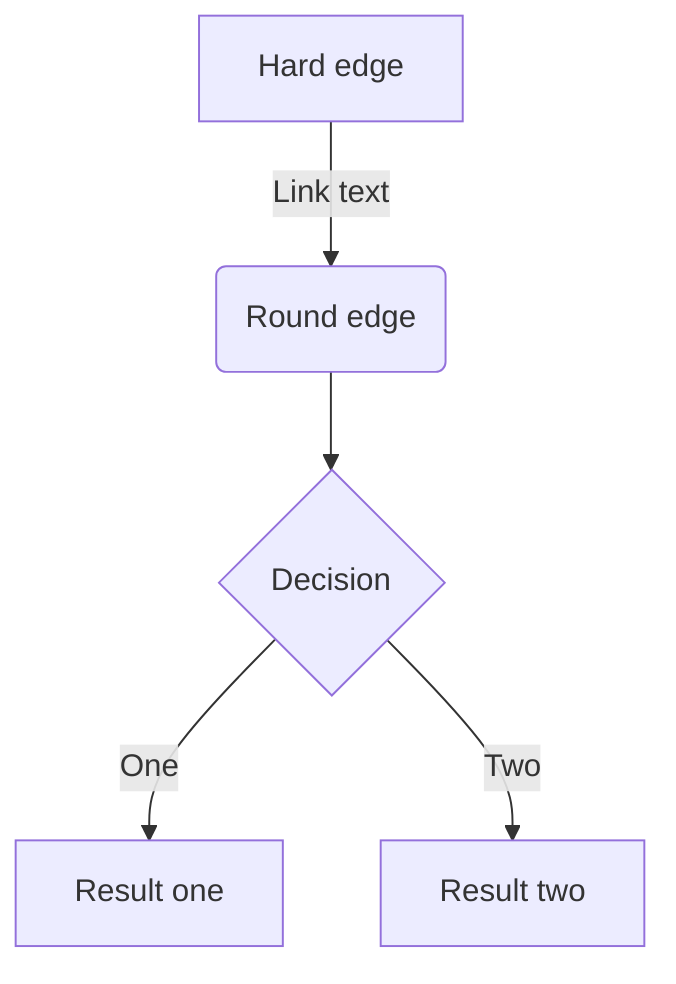

## 这是二级标题
### 这是三级标题
#### 这是四级标题
##### 这是五级标题
###### 这是六级标题
# 这是一级标题
**fdfdfdfd**
*fdfdfdf*
***fjldsjfkls***
>引用
----
****
[链接](http://baidu.com)

- 列表内容
+ 列表内容
* 列表内容

- 列表1
   - 列表2

1.列表内容
2.列表内容
3.列表内容

注意：序号跟内容之间要有空格


表头|表头|表头
---|:--:|---:
内容|内容|内容
内容|内容|内容

第二行分割表头和内容。
- 有一个就行，为了对齐，多加了几个
文字默认居左
-两边加：表示文字居中
-右边加：表示文字居右
注：原生的语法两边都要用 | 包起来。此处省略

姓名|年龄|职业
---|:--:|---:
张飞|20|屠夫

语法：
单行代码：代码之间分别用一个反引号包起来

`var a = 3;function a(){}`

代码块：代码之间分别用三个反引号包起来，且两边的反引号单独占一行

```
let a = 3;
 function fun(){
         echo "这是一句非常牛逼的代码";
 }
 fun();
```

#### 流程图


```flow
start=>start: 开始
loginInfo=>inputoutput: 登录数据
verifyLogin=>subroutine: 登录验证
isSuccess=>condition: 验证成功？
respondSuccess=>operation: 响应成功
responseFailure=>operation: 响应失败
end=>end: 结束

start->loginInfo->verifyLogin->isSuccess
isSuccess(yes)->respondSuccess->end
isSuccess(no)->responseFailure->end

start@>loginInfo({"stroke":"Red"})@>verifyLogin({"stroke":"Red"})@>isSuccess({"stroke":"Red"})@>respondSuccess({"stroke":"Red"})@>end({"stroke":"Red","stroke-width":6,"arrow-end":"classic-wide-long"})
```

```puml
a -> b
```
